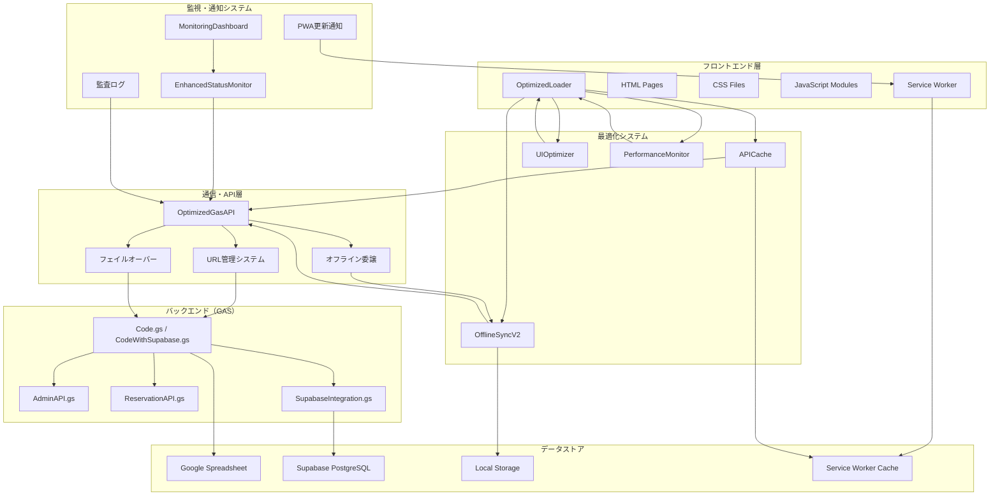
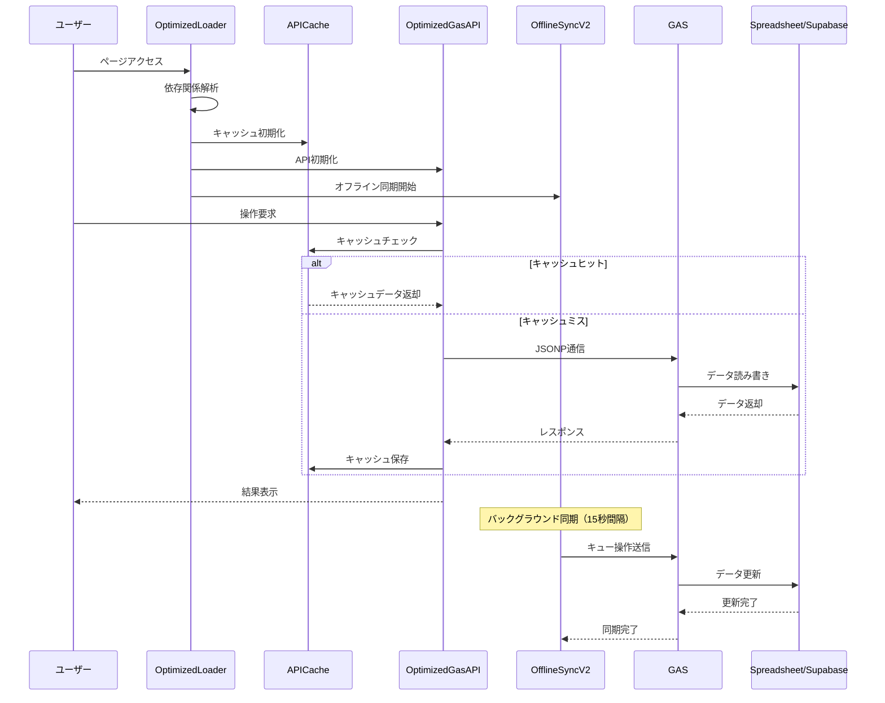
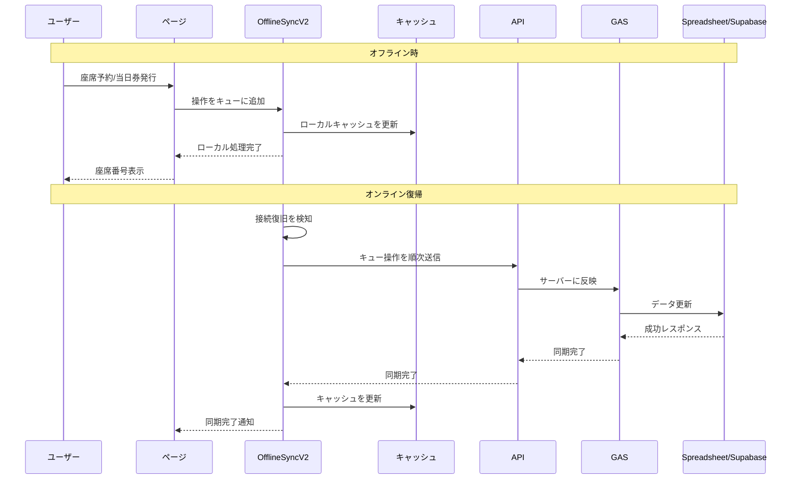
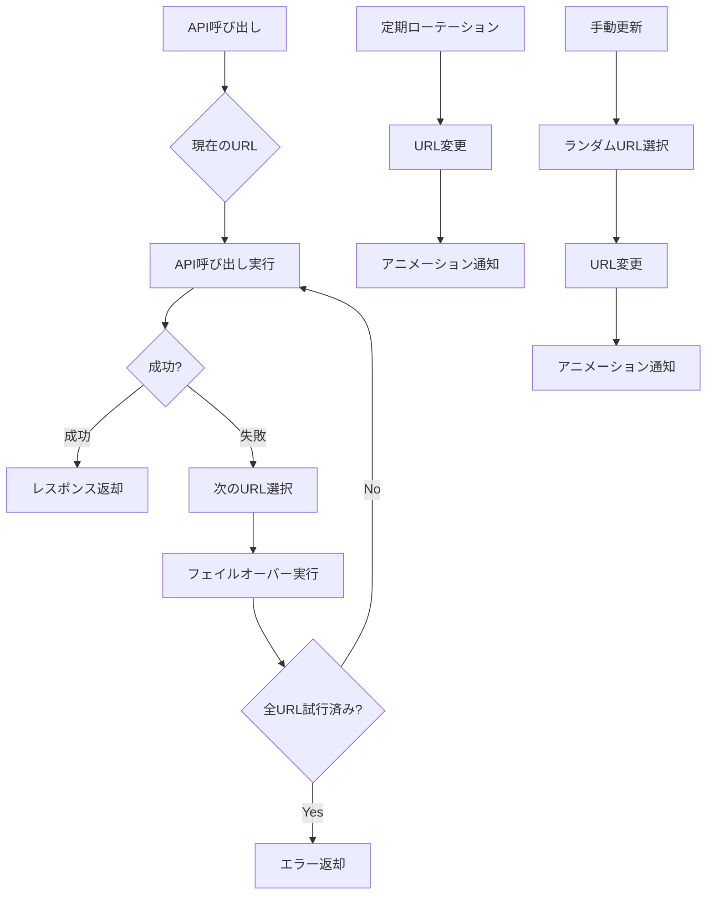

# 市川学園 座席管理システム v17.0.0

文化祭やイベント向けの座席予約・チェックイン・当日券発行・監視通知・最高管理者機能を備えた高機能Webアプリケーションです。静的フロントエンド（HTML/CSS/ES Modules）とGoogle Apps Script（GAS）バックエンド、さらにSupabase PostgreSQLデータベースを統合したハイブリッドアーキテクチャで構成されています。

## ✨ 主要な特徴

- **完全オフライン対応**: Service WorkerによるPWA実装で、インターネット接続なしでも全機能が利用可能
- **リアルタイム監視**: 15秒間隔で全公演の座席状況を監視し、容量レベルに応じた通知を自動送信
- **高度な同期システム**: オフライン時の操作を自動的にキューに保存し、オンライン復帰時に自動同期
- **URL負荷分散**: 複数GASプロジェクトによる自動ローテーションとフェイルオーバー機能
- **多段階認証**: 通常/管理者/当日券/最高管理者の4段階の権限管理
- **監査ログ**: 全操作を記録し、詳細な分析と監査が可能
- **Supabase統合**: PostgreSQLデータベースによる高速でスケーラブルなデータ管理

## 📋 目次

- [🚀 主な機能](#-主な機能)
- [🏗️ システム構成](#️-システム構成)
- [🎯 動作モード](#-動作モード)
- [📱 画面構成](#-画面構成)
- [🔐 最高管理者モード](#-最高管理者モード)
- [🎫 当日券機能](#-当日券機能)
- [⚙️ セットアップ手順](#️-セットアップ手順)
- [🎮 使い方](#-使い方)
- [🔧 設定とカスタマイズ](#-設定とカスタマイズ)
- [🛡️ セキュリティ](#️-セキュリティ)
- [📊 アーキテクチャ](#-アーキテクチャ)
- [🔄 技術仕様](#-技術仕様)
- [📁 ファイル構成](#-ファイル構成)
- [🚨 トラブルシューティング](#-トラブルシューティング)
- [📚 使用例](#-使用例)
- [🔮 今後の拡張予定](#-今後の拡張予定)

---

## 🚀 主な機能

### 基本機能
- **座席可視化と予約**: リアルタイムで座席状況を表示し、空席を選択して予約が可能
- **ステータス管理**: 予約済/確保/チェックイン待ち/チェックイン済の4段階ステータス表示
- **自動更新**: 座席マップを約30秒ごとに自動リフレッシュ（ユーザー操作時は一時停止）
- **手動更新**: 任意のタイミングで最新データを取得可能
- **URL管理システム**: 複数API URLの自動ローテーション（5分間隔）とフェイルオーバー機能

### 管理者機能
- **管理者モード**: 予約済/確保席の複数席同時チェックイン、座席名表示
- **当日券モード**: 空席の自動割当（1〜6枚）、連続席確保、ランダム割当
- **最高管理者モード**: 座席データのC、D、E列を自由に編集可能、全機能へのアクセス
- **予約管理画面**: 専用の管理画面（`admin.html`）で予約の一覧表示・検索・編集が可能

### オフライン対応機能
- **完全オフライン動作**: インターネット接続なしでも全機能が利用可能
- **ローカル処理**: キャッシュされた座席データでの即座な操作
- **自動同期**: オンライン復帰時に操作を自動でサーバーに反映（バックグラウンド同期間隔: 約15秒）
- **当日券オフライン発行**: オフライン時でも当日券を発行・座席番号を表示
- **Service Worker**: ページとアセットのオフラインキャッシュ（段階的キャッシュ戦略）

### 監視・通知機能
- **リアルタイム監視**: 15秒間隔で全公演の座席状況を監視
- **インテリジェント通知**: 容量レベル別の優先度通知システム（正常/警告/緊急/満席）
- **監視ダッシュボード**: リアルタイム表示と統計情報、詳細モーダル表示
- **重複防止**: クールダウン機能（5分間）で重複通知を防止
- **見本演劇除外**: テスト用公演をメール通知対象から自動除外

### PWA機能
- **PWA更新通知**: Service Workerが新しいデプロイを自動検知し、美しいUIで通知
- **ワンクリック更新**: 「今すぐ更新」ボタンで即座に最新版に更新
- **定期チェック**: 5分間隔での自動更新チェック
- **PWAインストール誘導**: OS別ガイド（iOS/Windows/Android）でインストールを促進
- **オフライン対応**: Service Workerによる完全なオフライン動作

### パフォーマンス最適化
- **OptimizedLoader**: 依存関係を考慮した並列モジュール読み込み
- **APICache**: インテリジェントキャッシュシステムによる重複API呼び出しの排除
- **UIOptimizer**: イベント処理とレンダリングの最適化
- **PerformanceMonitor**: リアルタイムパフォーマンス監視（`Ctrl+Shift+P`でダッシュボード表示）

---

## 🏗️ システム構成

### アーキテクチャ概要

このシステムは**ハイブリッドアーキテクチャ**を採用しています：

1. **フロントエンド**: 静的HTML/CSS/JavaScript（ES Modules）
2. **API層**: Google Apps Script（GAS）によるJSONP/JSON通信
3. **データストア**: Google Spreadsheet または Supabase PostgreSQL（選択可能）

```
┌─────────────────┐
│  フロントエンド  │
│ (HTML/CSS/JS)   │
└────────┬────────┘
         │ JSONP/JSON
         ↓
┌─────────────────┐
│  GAS API層      │
│ (Code.gs等)     │
└────────┬────────┘
         │
    ┌────┴────┐
    ↓         ↓
┌────────┐ ┌─────────┐
│Spread- │ │Supabase │
│sheet   │ │PostgreSQL│
└────────┘ └─────────┘
```

### フロントエンド（v17.0.0最適化版）

- **静的ファイル群**: HTML/CSS/ES Modules（ビルド不要、即座にデプロイ可能）
- **モジュラー設計**: 機能別にファイルを分割し、依存関係を明確化
- **レスポンシブデザイン**: モバイル・タブレット・デスクトップに完全対応
- **PWA対応**: Service Worker、マニフェスト、オフライン動作を完全実装
- **最適化システム**:
  - **OptimizedLoader**: 依存関係を考慮した並列モジュール読み込み
  - **APICache**: インテリジェントキャッシュシステム（重複排除、TTL管理）
  - **UIOptimizer**: イベント処理とレンダリングの最適化
  - **PerformanceMonitor**: リアルタイムパフォーマンス監視
- **オフライン同期システム**: 完全オフライン動作を実現（v2.0以降）
- **強化監視システム**: リアルタイム座席状況監視と通知

### バックエンド（Google Apps Script）

#### メインAPI（Spreadsheet版）
- **`Code.gs`**: メインAPI処理とビジネスロジック（存在する場合）
  - API ルーター: `doGet`/`doPost`によるJSONP通信処理
  - 座席管理、予約、チェックイン、当日券、最高管理者機能

#### Supabase対応API（推奨）
- **`CodeWithSupabase.gs`**: Supabase対応のメインAPI処理
  - 既存API関数のSupabase対応版
  - PostgreSQLデータベースへのアクセス
  - より高速でスケーラブルなデータ処理
- **`SupabaseIntegration.gs`**: GASからSupabaseへの接続クラス
- **`SupabaseSettings.gs`**: Supabase設定管理

#### 機能別APIモジュール
- **`AdminAPI.gs`**: 管理者機能専用API
- **`ReservationAPI.gs`**: 予約機能専用API
- **`MasterDataAPI.gs`**: マスターデータ管理API

#### 設定・データ管理
- **`SpreadsheetIds.gs`**: スプレッドシートID管理（Spreadsheet版使用時）
- **`TimeSlotConfig.gs`**: 時間帯設定管理（存在する場合）
- **`system-setting.gs`**: パスワード設定ユーティリティ（最高管理者パスワード含む）
- **`MissingFunctions.gs`**: 補助関数集

### データストア

#### Google Spreadsheet（従来版）
- **座席データ**: 各公演の座席シート（列: A=行ラベル、B=列番号、C=ステータス、D=予約名、E=チェックイン）
- **ログデータ**: 操作ログ、監査ログ
- **設定データ**: システム設定、パスワード（スクリプトプロパティ）

#### Supabase PostgreSQL（推奨版）
- **performancesテーブル**: 公演情報（group_name, day, timeslot）
- **seatsテーブル**: 座席情報（performance_id, seat_id, status, reserved_by等）
- **reservationsテーブル**: 予約履歴
- **system_settingsテーブル**: システム設定

詳細なスキーマは `database/supabase-schema.sql` を参照してください。

### 通信層（最適化）

- **OptimizedGasAPI**: キャッシュ対応のAPI呼び出し
- **URL管理システム**: 複数API URLの自動管理とローテーション（5分間隔）
- **フェイルオーバー機能**: API呼び出し失敗時の自動切り替え
- **オフライン委譲機能**: オフライン時の操作をローカル処理に委譲
- **キャッシュ統合**: API呼び出しの重複排除と最適化

---

## 🎯 動作モード（サイドバー > モード変更）

| モード | 権限 | 機能 | 認証 |
|--------|------|------|------|
| **通常モード** | 一般ユーザー | 座席予約が可能 | 不要 |
| **管理者モード** | 管理者 | チェックイン、座席名表示、複数席同時チェックイン | パスワード必要 |
| **当日券モード** | 当日券担当 | 空席自動割当、当日券発行（1〜6枚） | パスワード必要 |
| **最高管理者モード** | 最高管理者 | 座席データ編集、当日券発行、全権限 | パスワード必要 |

### モード切替方法

1. **サイドバーからの切替**: 画面左上のメニューボタン → 「モード変更」 → モード選択 → パスワード入力
2. **URLパラメータ**: `?mode=<normal|admin|walkin|superadmin>&password=<パスワード>` で直接アクセス可能

---

## 📱 画面構成

### メインページ
- **`index.html`**: 組選択ページ（オーケストラ部、吹奏楽部、マーチング、音楽部、演劇部）
- **`pages/timeslot.html`**: 時間帯選択ページ
- **`pages/seats.html`**: 座席選択・予約ページ（通常/管理者/最高管理者/当日券）
- **`pages/walkin.html`**: 当日券発行ページ（当日券/最高管理者専用）
- **`pages/reservation-status.html`**: 予約状況確認ページ
- **`pages/reservation.html`**: 予約管理ページ

### 管理者ページ
- **`pages/admin-login.html`**: 管理者ログインページ
- **`pages/admin.html`**: 管理者予約管理画面（Supabase版）
- **`pages/admin-scan.html`**: QRコードスキャンによるチェックイン
- **`pages/admin-settings.html`**: 管理者設定画面
- **`pages/logs.html`**: 操作ログ表示ページ（最高管理者専用）
- **`pages/monitoring-dashboard.html`**: 監視ダッシュボード

### 共通レイアウト/部品
- **`assets/css/styles.css`**: 全体スタイル
- **`assets/js/sidebar.js`** / **`assets/css/sidebar.css`**: サイドバー、モード切替モーダル、ナビゲーション

### 機能別ファイル
- **`assets/js/seats-main.js`** / **`assets/css/seats.css`**: 座席マップ表示・予約・チェックイン・最高管理者編集・当日券ナビゲーション
- **`assets/js/walkin-main.js`** / **`assets/css/walkin.css`**: 当日券発行、枚数選択（±ボタン対応）
- **`assets/js/timeslot-main.js`** / **`assets/js/timeslot-schedules.js`**: 時間帯選択（フロント固定データ）

---

## 🔐 最高管理者モードの詳細機能

### 権限と表示
- 管理者モードと同様に座席に名前が表示される
- ヘッダーに「最高管理者モード」の表示（濃い赤色）
- 座席クリック時に視覚的フィードバック（濃い赤色で選択状態表示）

### 座席編集機能
- **任意の座席を選択可能**: ステータスに関係なく全ての座席をクリック可能
- **編集モーダル表示**: 座席クリック時にC、D、E列の編集フォームが表示
- **列別編集**:
  - **C列**: ステータス（空、確保、予約済など）
  - **D列**: 予約名・備考
  - **E列**: チェックイン状態・その他
- **確認ダイアログ**: 確定ボタンで「本当に変更しますか？」の確認
- **自動更新**: 編集後は座席データが自動再読み込みされる

### セキュリティ
- `SUPERADMIN_PASSWORD`によるパスワード認証（GASスクリプトプロパティに保存）
- スプレッドシートの直接更新（C、D、E列のみ）
- 全ての操作が監査ログに記録される

### 視覚的フィードバック
- 選択された座席は濃い赤色（#8B0000）で表示
- 白いボーダーと影で視認性を向上
- 単一選択（他の座席の選択は自動クリア）

---

## 🎫 当日券機能（オンライン/オフライン同等の席選定ロジック）

### アクセス制限
- **ページレベル制限**: 当日券ページ（`walkin.html`）は当日券モードまたは最高管理者モードでのみアクセス可能
- **自動リダイレクト**: 許可されていないモードでアクセスした場合、座席選択ページに自動リダイレクト
- **ボタンレベル制限**: 座席選択画面の当日券ボタンは、許可されたモードでのみ表示・有効化
- **リアルタイム制御**: サイドバーでモード変更時に即座にアクセス制限が適用される

### 発行方法（挙動の統一）
- **一緒（同一行の連続席で確保）**: 行優先 A→E、席番号昇順で同一行の連番を確保（オンライン/オフライン同一）。通路は跨がない（C列 13-14 間／25-26 間の通路を跨ぐ並びは不可）。
- **どこでもよい**: 行優先 A→E、席番号昇順で先頭から必要数を確保（ランダムではなく決定的に統一）。

### 枚数選択
- 1〜6枚の範囲で選択可能
- ±ボタンによる直感的な操作
- 再入防止機能で誤操作を防止

### オフライン当日券発行
- **ローカル処理**: オフライン時でもキャッシュされた座席データで当日券を発行
- **座席表示**: オフライン発行時も実際の座席番号を表示（例：`A1 / A2 (ローカル処理)`）
- **自動同期**: オンライン復帰時にローカル予約を当日券として正式登録
- **重複防止**: ローカルで予約した座席をそのまま当日券として登録（新規座席割当なし）
- **当日券用空席データ**: 当日券モード時に約10秒間隔でプルし、ローカル座席キャッシュが空でも補完

---

## ⚙️ セットアップ手順

### 前提条件
- Googleアカウント（GAS使用のため）
- Supabaseアカウント（Supabase版使用の場合、無料プランで可）
- 静的ホスティング環境（GitHub Pages、Netlify、Vercel等）

### 1. スプレッドシート準備（Spreadsheet版の場合）

1. 各公演（組/日/時間帯）に対応するスプレッドシートを用意
2. 座席シート名は `Seats` に統一
3. 列レイアウト（`Code.gs` の参照範囲に一致）
   - **A列**: 行ラベル（A〜E）
   - **B列**: 列番号（1〜12、E は 1〜6）
   - **C列**: ステータス（`空`/`確保`/`予約済`）
   - **D列**: 予約名（任意）
   - **E列**: チェックイン（`済` のみ使用）

### 2. Supabaseセットアップ（Supabase版の場合、推奨）

1. **Supabaseプロジェクトを作成**
   - [Supabase Dashboard](https://supabase.com/dashboard) にアクセス
   - 新しいプロジェクトを作成
   - プロジェクトURLとAPIキーを取得

2. **データベーススキーマの実行**
   ```sql
   -- database/supabase-schema.sql の内容をSupabase SQL Editorで実行
   ```

3. **GAS設定の更新**
   - GASエディタで `SupabaseSettings.gs` を追加
   - `setupSupabaseSettings()` 関数を実行
   - 実際のSupabase設定に更新:
     ```javascript
     updateSupabaseSettings(
       'https://your-project.supabase.co',
       'your-anon-key',
       'your-service-role-key'
     );
     ```

### 3. GAS デプロイ

1. **Google Apps Script プロジェクトを作成**

2. **ファイルの追加**
   - Spreadsheet版: `Code.gs`（存在する場合）、`TimeSlotConfig.gs`、`SpreadsheetIds.gs`、`system-setting.gs`
   - Supabase版: `CodeWithSupabase.gs`、`SupabaseIntegration.gs`、`SupabaseSettings.gs`、`system-setting.gs`

3. **設定の更新**
   - `SpreadsheetIds.gs` の `SEAT_SHEET_IDS` を公演ごとに正しい ID へ更新（Spreadsheet版の場合）
   - `system-setting.gs` の `setupPasswords()` を一度実行して、全パスワードを設定

4. **ウェブアプリとしてデプロイ**
   - 実行する関数: `doGet`
   - アクセス権: 全員（匿名含む）/組織内など、運用ポリシーに合わせて設定
   - デプロイ URL を控えておく

### 4. フロント設定

1. **`assets/js/config.js` の設定**
   ```javascript
   // GAS API URLを設定（複数設定で負荷分散）
   const GAS_API_URLS = [
     "https://script.google.com/macros/s/YOUR_DEPLOY_ID/exec"
   ];

   // Supabase設定（Supabase版使用の場合）
   const SUPABASE_CONFIG = {
     url: "https://your-project.supabase.co",
     anonKey: "your-anon-key"
   };

   // 満席通知用メールアドレス
   const FULL_CAPACITY_NOTIFICATION_EMAILS = [
     'admin@example.com'
   ];
   ```

2. **ローカル開発時は、任意の静的サーバーで `index.html` を開いて動作確認**

### 5. デプロイ

- **GitHub Pages**: `gh-pages` ブランチにプッシュ
- **Netlify/Vercel**: リポジトリを接続して自動デプロイ
- **カスタムドメイン**: `CNAME` ファイルを設定

---

## 🎮 使い方

### 1. 組選択（`index.html`）
- 組（オーケストラ部、吹奏楽部、マーチング、音楽部、演劇部）を選択
- 選択すると `pages/timeslot.html?group=<組名>` のように遷移

### 2. 時間帯選択（`pages/timeslot.html`）
- 組に紐づく時間帯を表示（`timeslot-schedules.js` を参照）
- 選択するとモードに応じてページ遷移：
  - 通常: `pages/seats.html?group=<組名>&day=1&timeslot=A`
  - 当日券: `pages/walkin.html?group=<組名>&day=1&timeslot=A`
  - URL に `admin=true` が付与されている場合は管理者コンテキストが引き継がれる

### 3. 座席ページ（`pages/seats.html`）
- **通常モード**: 空席を選択し「この席で予約する」。予約後はステータスが更新される
- **管理者モード**: 予約済/確保席が選択可能となり、複数選択して「チェックイン」を実行可能
- **最高管理者モード**: 任意の座席をクリックしてC、D、E列のデータを編集可能
- **当日券ボタン**: 当日券モードまたは最高管理者モードでのみ表示・有効
- **自動更新**: 約30秒ごと（ユーザー操作時は一時停止）。手動更新ボタンもあり
- **モーダル**: 編集モーダルは開閉アニメーション付きで表示される

### 4. 当日券ページ（`pages/walkin.html`）
- **アクセス制限**: 当日券モードまたは最高管理者モードでのみアクセス可能
- **自動リダイレクト**: 許可されていないモードでアクセスした場合、座席選択ページに自動リダイレクト
- **枚数選択**: 枚数（1〜6）を ± ボタンまたは入力で指定
- **発行方法選択**: 2つの発行方法から選択:
  - **一緒（同一行の連続席で確保）**: 指定した枚数を同じ行で連続した席として確保（行をまたぐ並びは不可）
  - **どこでもよい**: 行優先 A→E、席番号昇順で先頭から必要数を確保
- **発行結果表示**: 発行後、割当席（単数/複数）を画面表示

### 5. 管理者画面（`pages/admin.html`）
- Supabase版の予約管理画面
- 予約の一覧表示・検索・編集が可能
- セッション管理による認証

---

## 🔧 設定とカスタマイズ

### 基本設定（`assets/js/config.js`）

- **API エンドポイント**: `GAS_API_URLS` 配列
- **Supabase設定**: `SUPABASE_CONFIG` オブジェクト（Supabase版使用時）
- **デバッグログ**: `DEBUG_MODE`
- **URL管理設定**: `APIUrlManager` クラス
- **ローテーション間隔**: デフォルト5分間隔（`rotationInterval`）

### 通知メール宛先の設定（重要）

- 宛先リストはフロント側の `config.js` にハードコードされています
- `FULL_CAPACITY_NOTIFICATION_EMAILS` を編集してください
- クライアントは送信時にこのリストを必ず注入し、GAS には統合済みの `emails` 配列を渡します

### 機能別設定

- **時間帯設定（フロント）**: `timeslot-schedules.js` の `TIMESLOT_SCHEDULES`
- **時間帯設定（GAS）**: `TimeSlotConfig.gs`（存在する場合）
- **スプレッドシート ID**: `SpreadsheetIds.gs` の `SEAT_SHEET_IDS` / `LOG_SHEET_IDS`（Spreadsheet版の場合）
- **サイドバー/モード UI**: `sidebar.js` / `sidebar.css`
- **座席レイアウト**: `seats-main.js` の `layout`（行/列/通路位置など）
- **座席スタイル**: `seats.css`（色、サイズ、凡例など）
- **当日券の枚数 UI**: `walkin.css`（`walkin-qty-*` クラス）
- **最高管理者モード**: `seats-main.js` の座席編集機能、`seats.css` のスタイル

### 変更のヒント

- 席行列構成を変える場合は、GAS 側の `isValidSeatId()`（行の最大席数）と、フロントの `layout`/描画に整合性を持たせてください
- シート名を変更する場合は、`SpreadsheetIds.gs` の `TARGET_SEAT_SHEET_NAME` を合わせて変更します（Spreadsheet版の場合）
- モード認証の要件を変える場合は、`sidebar.js` の `applyModeChange()` と GAS 側 `verifyModePassword()` を調整します
- 最高管理者モードの編集可能列を変更する場合は、`Code.gs` または `CodeWithSupabase.gs` の `updateSeatData()` 関数を修正します

---

## 🛡️ セキュリティ

### パスワード管理
- パスワードは GAS のスクリプトプロパティに保存
- リポジトリに平文で置かない
- 公開レベルは運用方針に従って最小権限にする

### 最高管理者モード
- 最高管理者モードは最も高い権限を持つため、適切なパスワード管理が重要
- 強力なパスワードの使用
- 定期的なパスワード変更
- 必要最小限のユーザーのみに権限を付与

### 当日券機能のアクセス制限
- **ページレベル制限**: 当日券ページ（`walkin.html`）は当日券モードまたは最高管理者モードでのみアクセス可能
- **自動リダイレクト**: 許可されていないモードでアクセスした場合、座席選択ページに自動リダイレクト
- **ボタンレベル制限**: 座席選択画面の当日券ボタンは、許可されたモードでのみ表示・有効化
- **リアルタイム制御**: サイドバーでモード変更時に即座にアクセス制限が適用される

### 監査ログ
- 全ての操作（予約、チェックイン、当日券発行、座席編集等）が監査ログに記録される
- ログにはタイムスタンプ、ユーザー情報、操作内容、変更前後の値が含まれる
- 最高管理者のみがログを閲覧可能（`pages/logs.html`）

---

## 📊 アーキテクチャ

### システム全体アーキテクチャ



### データフロー



---

## 🔄 技術仕様

### JSONP 通信
- `optimized-api.js` が `<script>` を生成し、`callback` で応答を受け取る
- タイムアウト: 通常20秒、大量集計/通知は無限待機
- キャッシュバスター、成功時はタイマー解除
- 失敗時は `GAS_API_URLS` の次URLに自動フェイルオーバー

### Walk-in 発行
- `walkin-main.js`
- 再入防止フラグで多重実行を抑止
- 複数席API失敗時は単発APIを複数回呼ぶフォールバック

### サイドバー
- `sidebar.js`
- オーバーレイで重ね表示、背景暗転
- 外側クリック/×で閉じる
- モード変更時は二重送信防止（処理中はボタン/入力を無効化）

### 最高管理者モード
- `seats-main.js`
- 座席クリックで編集モーダル表示
- C、D、E列のデータ編集
- スプレッドシート/Supabaseへの直接更新
- 視覚的フィードバックと選択状態管理

### オフライン同期システム（v2.0）

完全なオフライン動作を実現する高度な同期システム。インターネット接続が不安定な環境でも、すべての機能を継続して利用できます。

#### 主要機能

1. **ローカル処理**
   - **座席予約**: オフライン時でもキャッシュされた座席データで予約可能
   - **チェックイン**: ローカルでチェックイン状態を更新
   - **当日券発行**: オフライン時でも当日券を発行・座席表示
   - **座席編集**: 最高管理者モードでの座席データ編集

2. **自動同期**
   - **オンライン復帰検知**: ネットワーク接続復旧を自動検知
   - **操作キュー**: オフライン中の操作を順序付きで保存（最大200件）
   - **競合解決**: データ競合を自動で解決
   - **リトライ機能**: 失敗した操作の自動再試行（最大3回）
   - **バックグラウンド同期**: 約15秒おきにキュー同期/キャッシュ更新を実施

3. **キャッシュ管理**
   - **座席データキャッシュ**: 最新の座席情報をローカルに保存
   - **有効性チェック**: キャッシュの有効期限（24時間）と整合性を管理
   - **自動更新**: オンライン時のデータ取得でキャッシュを更新
   - **メモリ最適化**: キューサイズ200件、30秒間隔でクリーンアップ

#### オフライン動作フロー



#### 設定とカスタマイズ

- **同期間隔**: `OFFLINE_CONFIG.SYNC_INTERVAL` (デフォルト: 15秒)
- **リトライ回数**: `OFFLINE_CONFIG.MAX_RETRY_COUNT` (デフォルト: 3回)
- **キャッシュ有効期限**: `OFFLINE_CONFIG.CACHE_EXPIRY` (デフォルト: 24時間)
- **タイムアウト**: `OFFLINE_CONFIG.API_TIMEOUT` (デフォルト: 15秒)

詳細は `assets/js/offline-sync-v2.js` を参照してください。

### URL管理システム（v2.1）

複数のAPI URLを自動管理し、使用数上限回避と負荷分散を実現する高度なURL管理システム。

#### 主要機能

1. **自動ローテーション**
   - **定期切り替え**: 5分間隔で自動的にURLを切り替え
   - **ランダム初期化**: 起動時にランダムなURLを選択
   - **確実な変更**: 必ず現在のURLとは異なるURLを選択

2. **手動URL変更**
   - **更新ボタン**: 右上の「更新」ボタンで即座にURL変更
   - **アニメーション通知**: URL変更時に視覚的な通知を表示
   - **URL情報表示**: 現在使用中のAPI URLを表示

3. **フェイルオーバー機能**
   - **自動切り替え**: API呼び出し失敗時に次のURLに自動切り替え
   - **リトライ機能**: 複数URLでの再試行
   - **エラー処理**: 詳細なエラーログとデバッグ情報

#### URL管理フロー



#### 設定方法

```javascript
// config.js
const GAS_API_URLS = [
  "https://script.google.com/macros/s/MAIN_DEPLOY_ID/exec",
  "https://script.google.com/macros/s/BACKUP_DEPLOY_ID/exec",
  "https://script.google.com/macros/s/THIRD_DEPLOY_ID/exec"
];

// ローテーション間隔の調整
// APIUrlManager クラス内
this.rotationInterval = 5 * 60 * 1000; // 5分間隔（ミリ秒）
```

詳細は `assets/js/config.js` の `APIUrlManager` クラスを参照してください。

### 強化座席監視システム（v2.3）

リアルタイムで全公演の座席状況を監視し、容量レベルに応じたインテリジェント通知システムを提供する高度な監視システムです。

#### 主要機能

1. **リアルタイム監視**
   - **頻繁なチェック**: デフォルト15秒間隔で全公演の座席状況を監視
   - **状態変化検知**: 前回の状態と比較して変化を検出
   - **容量レベル判定**: 正常・警告・緊急・満席の4段階で分類
   - **見本演劇除外**: テスト用公演を自動的に監視対象から除外

2. **インテリジェント通知システム**
   - **優先度別通知**: 高・中・低の3段階で通知優先度を設定
   - **重複防止**: クールダウン機能（5分間）で同じ公演への重複通知を防止
   - **詳細レポート**: 統計情報とトレンド分析を含む包括的なメール通知
   - **フィルタリング**: 見本演劇などのテスト用公演を通知対象から除外

3. **監視ダッシュボード**
   - **リアルタイム表示**: 現在の座席状況を視覚的に表示
   - **統計情報**: システムの動作状況とパフォーマンス指標
   - **詳細モーダル**: 各公演カードをクリックで詳細な座席分析データを表示
   - **設定管理**: 監視間隔や閾値の動的変更

#### 容量レベル

| レベル | 条件 | 色 | 説明 |
|--------|------|-----|------|
| 正常 | 6席以上 | 緑 | 十分な空席がある |
| 警告 | 3-5席 | 黄 | 空席が少なくなってきた |
| 緊急 | 1-2席 | オレンジ | 空席が非常に少ない |
| 満席 | 0席 | 赤 | 空席がない |

詳細は `assets/js/enhanced-status-monitor.js` と `pages/monitoring-dashboard.html` を参照してください。

### DEMOモード

DEMOモードは、指定したURLパラメータからのみ起動でき、UIには表示されない隠しモードです。DEMOモード中はシステム全体が「見本演劇」専用として動作します。

#### 特徴
- UI上のモード表示・切替には一切出ません（隠しモード）
- URLパラメータでのみ起動可能（例: `?demo=1`）
- DEMO中はグループが強制的に「見本演劇」になります
- 予約・チェックイン・当日券発行・最高管理者などの機能は通常通り使えます（対象は「見本演劇」に限定）
- 「見本演劇」以外のクラスへアクセスしようとすると「権限がありません」と表示されます

#### 起動方法
任意のページのURLに `demo=1` を付与してアクセスします。

例:
```
pages/seats.html?group=見本演劇&day=1&timeslot=A&demo=1
```

#### 解除方法

**URLパラメーターでの解除**
任意のページのURLに `demo=0` を付与してアクセスします。

対応するパラメーター値: `demo=0`, `demo=false`, `demo=off`, `demo=no`, `demo=disable`

**コンソールでの解除**
```javascript
DemoMode.disable()
```

詳細は `assets/js/config.js` の `DemoModeManager` を参照してください。

---

## 📁 ファイル構成

### 🌐 フロントエンド（HTML/CSS/JS）

#### メインページ
- **`index.html`**: 組選択ページのメインHTML
  - サイドバーコンテナ、組選択UI、基本レイアウト
  - PWA更新通知機能、URL管理システム情報表示
  - 依存: `styles.css`, `sidebar.css`, `config.js`, `optimized-loader.js`, `index-main.js`

- **`assets/js/index-main.js`**: 組選択ページのメインロジック
  - 組一覧の表示、選択時のナビゲーション処理
  - 依存: `config.js`, `optimized-api.js`, `sidebar.js`

#### 時間帯選択
- **`pages/timeslot.html`**: 時間帯選択ページのメインHTML
- **`assets/js/timeslot-main.js`**: 時間帯選択ページのメインロジック
- **`assets/js/timeslot-schedules.js`**: 時間帯スケジュール定義（フロント固定データ）

#### 座席選択・予約
- **`pages/seats.html`**: 座席選択・予約ページのメインHTML
- **`assets/js/seats-main.js`**: 座席選択・予約ページのメインロジック
  - 座席マップ描画、予約処理、チェックイン処理、最高管理者編集機能
  - 自動更新機能、楽観的更新、エラーハンドリング
- **`assets/css/seats.css`**: 座席選択ページ専用スタイル

#### 当日券発行
- **`pages/walkin.html`**: 当日券発行ページのメインHTML
- **`assets/js/walkin-main.js`**: 当日券発行ページのメインロジック
  - 当日券発行処理、枚数選択、連続席/ランダム選択機能
  - アクセス制限、エラーハンドリング
- **`assets/css/walkin.css`**: 当日券ページ専用スタイル

#### 管理者画面
- **`pages/admin-login.html`**: 管理者ログインページ（Supabase版）
- **`pages/admin.html`**: 管理者予約管理画面（Supabase版）
- **`pages/admin-scan.html`**: QRコードスキャンによるチェックイン
- **`pages/admin-settings.html`**: 管理者設定画面
- **`assets/js/admin.js`**: 管理者画面のメインロジック
- **`assets/js/admin-scan.js`**: QRコードスキャン機能
- **`assets/js/admin-settings.js`**: 管理者設定機能
- **`assets/css/admin.css`**: 管理者画面専用スタイル

#### ログ・監視
- **`pages/logs.html`**: 操作ログ表示ページ（最高管理者専用）
- **`assets/js/logs-main.js`**: 操作ログ表示ページのメインロジック
- **`assets/css/logs.css`**: ログページ専用スタイル
- **`pages/monitoring-dashboard.html`**: 強化監視ダッシュボード
- **`assets/js/enhanced-status-monitor.js`**: 強化座席監視システム

#### 最適化・共通ファイル
- **`assets/js/optimized-loader.js`**: 最適化されたスクリプトローダー
- **`assets/js/api-cache.js`**: インテリジェントキャッシュシステム
- **`assets/js/optimized-api.js`**: 最適化されたAPI呼び出し機能
- **`assets/js/ui-optimizer.js`**: UI応答性の最適化
- **`assets/js/performance-monitor.js`**: パフォーマンス監視
- **`assets/js/config.js`**: システム設定とURL管理機能
- **`assets/css/styles.css`**: 全体共通スタイル
- **`assets/js/sidebar.js`** / **`assets/css/sidebar.css`**: サイドバーとモード管理機能

#### システム管理
- **`assets/js/system-lock.js`**: システムロック機能
- **`assets/js/error-handler.js`**: エラーハンドリング機能
- **`assets/js/audit-logger.js`**: 監査ログシステム
- **`assets/js/pwa-update.js`**: PWA更新通知システム
- **`assets/js/pwa-install.js`**: PWAインストール促進機能

#### オフライン同期システム
- **`assets/js/offline-sync-v2.js`**: オフライン同期システム（v2.0最適化版）
- **`assets/css/offline-sync-v2.css`**: オフライン同期UI
- **`sw.js`**: Service Worker（v2.3 PWA更新対応版）

#### PWA関連ファイル
- **`manifest.json`**: PWAマニフェスト
- **`browserconfig.xml`**: ブラウザ設定

### 🔧 バックエンド（Google Apps Script）

#### メインAPI
- **`gas/Code.gs`**: メインAPI処理とビジネスロジック（Spreadsheet版、存在する場合）
- **`gas/CodeWithSupabase.gs`**: Supabase対応のメインAPI処理（推奨）
  - API ルーター: `doGet`/`doPost`によるJSONP通信処理
  - 座席管理、予約、チェックイン、当日券、最高管理者機能
  - 依存: `SupabaseIntegration.gs`, `SupabaseSettings.gs`

#### 機能別APIモジュール
- **`gas/AdminAPI.gs`**: 管理者機能専用API
- **`gas/ReservationAPI.gs`**: 予約機能専用API
- **`gas/MasterDataAPI.gs`**: マスターデータ管理API

#### Supabase統合
- **`gas/SupabaseIntegration.gs`**: GASからSupabaseへの接続クラス
- **`gas/SupabaseSettings.gs`**: Supabase設定管理

#### 設定・データ管理
- **`gas/SpreadsheetIds.gs`**: スプレッドシートID管理（Spreadsheet版使用時）
- **`gas/system-setting.gs`**: パスワード設定ユーティリティ（最高管理者パスワード含む）
- **`gas/MissingFunctions.gs`**: 補助関数集

### 📊 データベース

- **`database/supabase-schema.sql`**: Supabase用データベーススキーマ
- **`database/reservation-feature.sql`**: 予約機能用SQL
- **`database/refactor-master-data.sql`**: マスターデータリファクタリング用SQL

### 📚 ドキュメント

- **`docs/IMPLEMENTATION_README.md`**: GAS + Supabase ハイブリッド座席管理システム実装ガイド
- **`docs/SUPABASE_MIGRATION_README.md`**: Supabase移行ガイド
- **`docs/CompleteMigrationSummary.md`**: 移行完了サマリー

---

## 🚨 トラブルシューティング

### 一般的な問題

#### JSONP タイムアウト
- GAS の公開設定が「全員（匿名）」になっているか確認
- 最新の /exec を `config.js` に設定（必要に応じて `GAS_API_URLS` に追加）
- 疎通テスト: `https://<GAS>/exec?callback=cb&func=testApi&params=%5B%5D` を開く前に `function cb(x){console.log(x)}` を定義

#### verifyModePassword の多重呼び出し
- 二重送信防止済み。古いキャッシュならハードリロード

#### Walk-in の二重発行
- 再入防止済み。最新に更新して再試行

### 最高管理者モード特有の問題

#### 座席編集できない
- `SUPERADMIN_PASSWORD` が正しく設定されているか確認
- `system-setting.gs` の `checkPasswords()` で確認
- スプレッドシート/Supabaseの権限設定を確認

#### 編集モーダルが表示されない
- 最高管理者モードに正しくログインしているか確認
- ブラウザのコンソールでエラーメッセージを確認

### GAS疎通テスト
- サイドバーの「GAS疎通テスト」ボタンを使用
- 詳細なエラー情報を確認
- 必要に応じて新しいデプロイURLを取得

### Supabase接続エラー（Supabase版の場合）
- Supabase設定の確認（URL、APIキー）
- ネットワーク接続を確認
- GASエディタで `testSupabaseConnection()` を実行

---

## 📚 使用例

### 最高管理者モードの使用例

#### 1. パスワード設定
```javascript
// GASエディタで実行
setupSuperAdminPassword(); // デフォルト: superadmin
// または
changeSuperAdminPassword('mySecurePassword'); // カスタムパスワード
```

#### 2. 座席データ編集
1. サイドバーから「モード変更」を選択
2. 「最高管理者モード」を選択し、パスワードを入力
3. 任意の座席をクリック
4. C、D、E列の内容を編集
5. 「確定」ボタンを押す
6. 確認ダイアログで「はい」を選択
7. スプレッドシート/Supabaseが更新される

#### 3. 編集可能な列
- **C列**: ステータス（空、確保、予約済など）
- **D列**: 予約名や備考
- **E列**: チェックイン状態やその他の情報

### 操作方法（補足）

#### サイドバー操作
- 画面左上のメニューで開閉
- 開いている間は背景が暗転
- 外側クリックまたは「×」で閉じる

#### モード変更
- サイドバー内「モード変更」
- 処理中はボタン/入力が無効化される
- パスワード認証が必要

#### 当日券発行
- ± ボタンで枚数調整（1〜6）
- 処理中は二重実行されない

---

## 🔮 今後の拡張予定

### 機能拡張
- リアルタイム座席状況の表示（WebSocket対応）
- 予約履歴の管理機能強化
- 統計・レポート機能の充実
- QRコードによるチェックイン機能の拡張

### 技術的改善
- WebSocket対応によるリアルタイム通信
- さらなるパフォーマンス最適化
- モバイルアプリ対応（React Native等）
- AIによる座席最適化提案

### セキュリティ強化
- 多要素認証（MFA）
- 監査ログの強化
- 暗号化通信の強化
- レート制限の実装

---

## 📄 ライセンス

- リポジトリの `LICENSE` を参照

## 🤝 コントリビューション

- プルリクエストを歓迎
- コーディング規約に従ってください
- テストの追加も推奨

---

## 📞 サポート・フィードバック

### 問題報告
- GitHub Issues で問題を報告
- 詳細なエラーログと再現手順を記載

### 機能要望
- 新機能の提案は GitHub Discussions で
- ユースケースと期待する動作を記載

### ドキュメント改善
- READMEの改善提案も歓迎
- 分かりにくい部分の指摘

---

**最終更新**: 2025年1月
**バージョン**: v17.0.0
